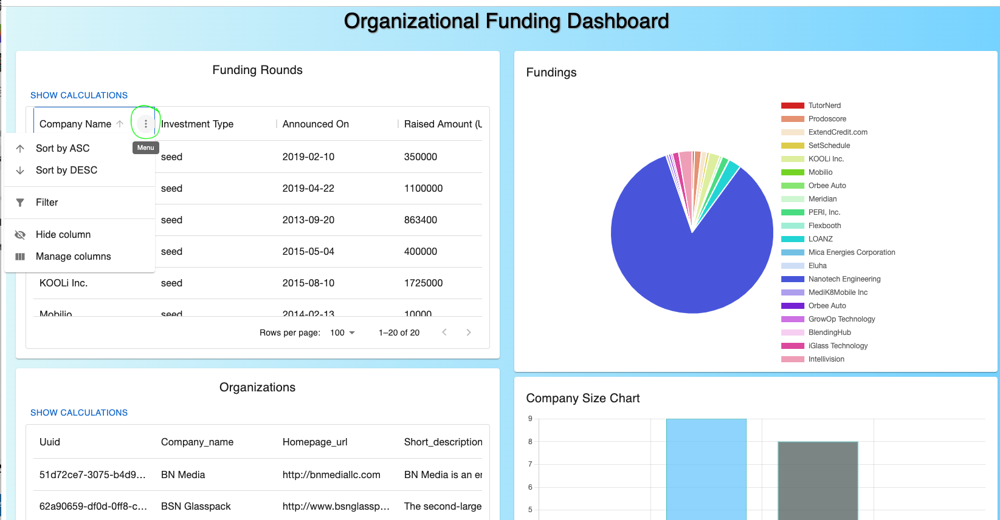
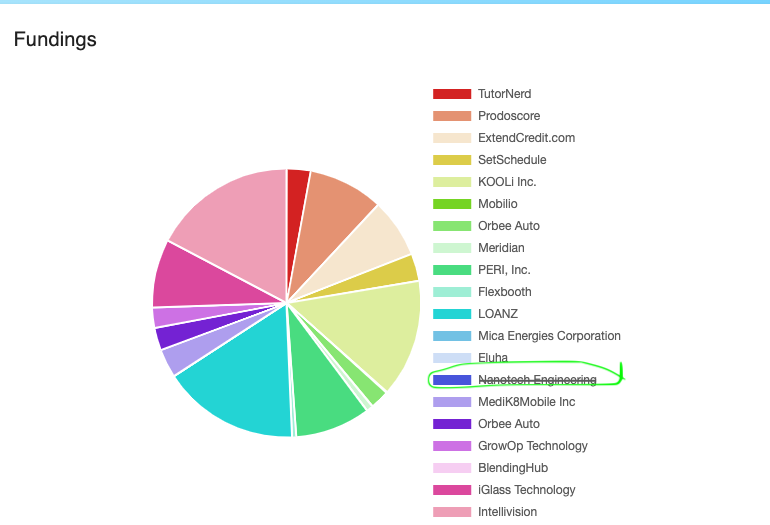

# 🚀 Motherbrain Full Stack Challenge


## 📝 Project Overview

This repository contains a full-stack application designed to explore data from ElasticSearch indices and visualize it using charts and graphs. The backend is built using Node.js and the frontend is powered by React.

## 🛠️ Getting Started

### Prerequisites

- 🐳 [Docker](https://www.docker.com/) installed (recommended)
- Alternatively, ensure 🌍 [Node.js](https://nodejs.org/) and 📦 [Yarn](https://yarnpkg.com/) are installed locally.

### Running the Project

#### Using Docker (Recommended)

1. 📂 Clone or fork this repository.
2. Navigate to the root folder.
3. Run the following command to start the project:

   ```bash
   docker compose up
   ```

4. 🖥️ Open your browser and navigate to [http://localhost:3000](http://localhost:3000) to view the application.

#### Using Node.js and Yarn (Alternative)

1. 📂 Clone or fork this repository.
2. Navigate to the `backend` folder and run:

   ```bash
   yarn start
   ```

3. In a separate terminal, navigate to the `frontend` folder and run:

   ```bash
   yarn start
   ```

4. 🖥️ Open your browser and navigate to [http://localhost:3000](http://localhost:3000) to view the application.

## 📊 Project Details

### Backend

- 🛠️ Node.js backend with a connection to an ElasticSearch node.
- 🗃️ Two pre-populated indices:
  - `org` - Collection of organizations. Accessed via [http://localhost:8080/orgs](http://localhost:8080/orgs).
  - `funding` - Collection of funding rounds. Accessed via [http://localhost:8080/fundings](http://localhost:8080/fundings).
- Endpoint implementations located in `backend/src/index.js`.
- Use `yarn start` to start the backend in development mode.
- Additional scripts:
  - `yarn test` - Run tests using Jest.
  - `yarn format` - Automatically format the codebase using Prettier.

### Frontend

- 🎨 React-based frontend using various charting libraries:
  - `@mui/x-charts` for interactive charts.
  - `react-chartjs-2` for advanced chart customization.
- Displays two interactive tables:
  - `OrgTable` for organizations data, with built-in filters and menus for easy data manipulation.
  - `FundingTable` for funding data, with similar built-in features for filtering and sorting.
- Includes two interactive charts:
  - A pie chart (`FundingChart`) for funding data, allowing you to toggle company visibility by clicking on the legend.
  - A pillar chart (`CompanySizeChart`) for organizations data.
- Predefined npm scripts to streamline development.
- Use `yarn start` to start the production server.
- Additional scripts:
  - `yarn build` - Build the production version of the application.
  - `yarn test` - Run tests using Jest.
  - `yarn format` - Automatically format the codebase using Prettier.

### Dashboard Screenshots

**Table View:** Shows data tables with interactive filters and menus.



**Pie Chart View:** Demonstrates how company visibility can be toggled on and off.



## ✅ Continuous Integration

The project has a CI pipeline using GitHub Actions. The workflow includes:

1. 📂 Checking out the code.
2. 📦 Installing dependencies and running tests for both frontend and backend.
3. 🎨 Running Prettier for code formatting checks.
4. 🐳 Building and running Docker services.

## 🤝 Contribution Guidelines

1. Fork the repository.
2. Create a new branch (`git checkout -b feature/your-feature`).
3. Commit your changes (`git commit -am 'Add new feature'`).
4. Push to the branch (`git push origin feature/your-feature`).
5. Create a Pull Request.

## 📜 License

This project is licensed under the MIT License.
